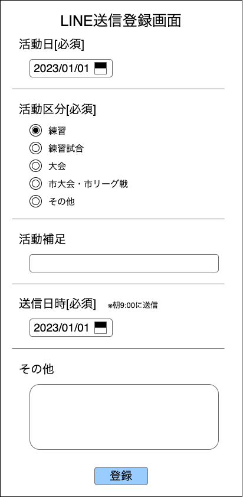

裏方作業システム 
LINE送信登録画面 

- [1. 画面概要](#1-画面概要)
- [2. POSTデータ](#2-postデータ)
- [3. 画面項目](#3-画面項目)
  - [3.1. 活動日](#31-活動日)
    - [3.1.1. 初期表示](#311-初期表示)
    - [3.1.2. エラーチェックと表示内容](#312-エラーチェックと表示内容)
    - [3.1.3. 活動日が変更された際の処理](#313-活動日が変更された際の処理)
  - [3.2. スケジュールID](#32-スケジュールid)
    - [3.2.1. 初期表示](#321-初期表示)
    - [3.2.2. 表示条件](#322-表示条件)
  - [3.3. 活動区分](#33-活動区分)
    - [3.3.1. 初期表示](#331-初期表示)
    - [3.3.2. 活動区分が変更された際の処理](#332-活動区分が変更された際の処理)
  - [3.4. 活動補足](#34-活動補足)
    - [3.4.1. 初期表示](#341-初期表示)
  - [3.5. 送信日付](#35-送信日付)
    - [3.5.1. 初期表示](#351-初期表示)
    - [3.5.2. エラーチェックと表示内容](#352-エラーチェックと表示内容)
  - [3.6. 登録ボタン](#36-登録ボタン)
    - [3.6.1. 活性化判定](#361-活性化判定)
    - [3.6.2. 押下処理](#362-押下処理)

# 1. 画面概要
- 滋賀フリーダム全体LINEに送信するスケジュール入力催促リマインダーの登録を行う

# 2. POSTデータ

| Key | Value形式 | 内容 |
| :--: | :-- | :-- |
| page | "4" | 画面ID※空白不可 |
| active_date | yyyyMMdd | 活動日 |
| schedule_id | 半角数値 | スケジュールID |
| active_class | X | 活動区分 |
| active_additional | テキスト | 活動補足 |
| send_date | yyyyMMdd | 送信日付 |
| other | テキスト | その他 |

# 3. 画面項目

| No | 項目 | 形式 | POSTデータとの対応 | その他 |
| :--: | :-- | :-- | :-- | :-- |
| 1 | 活動日 | 日付ピッカー | active_date | 初期値：翌週の日曜日の日付 |
| 2 | スケジュールID | ラベル | schedule_id | 確認画面でのDB登録の際にエラーチェックを行うため |
| 3 | 活動区分 | ラジオボタン | active_class | 選択肢：練習(初期値)、練習試合、大会、その他 |
| 4 | 活動補足 | 入力欄(1行) | active_additional |
| 5 | 送信日付 | 日付ピッカー | send_date | 初期値：活動日の前週の火曜日 |
| 6 | その他 | 入力欄 | other | |
| 7 | 登録 | ボタン | 押下時：LINE送信確認画面に遷移 |

- 各項目のPOSTデータがそれぞれ存在している場合はその値を初期値として表示する

## 3.1. 活動日
### 3.1.1. 初期表示
| 条件 | 表示内容 | その他 |
| :-- | :-- | :--|
| POSTデータ"active_date"が存在 | POSTデータを表示 | |
| 上記以外 | 翌週の日曜日の日付を表示 | |

### 3.1.2. エラーチェックと表示内容
- 登録ボタン押下時、活動日変更時にエラーチェックを行う
- 入力欄下に赤字でエラー内容を表示する

| 条件 | 表示内容 | その他 |
| :--: | :-- | :-- |
| 日付が本日以前の場合 | 翌日以降の日付を選択してください。 |

### 3.1.3. 活動日が変更された際の処理
- 活動区分、活動補足、送信日付を変更する
  - 各項目にデータが存在する場合はその値をそのまま入れる
    - スケジュールID[schedules].[schedule_id]
    - 活動区分：[schedules].[active_category]
    - 活動補足：[schedules].[additional_info]
    - 送信日付：[remind_input_schedule_infos].[send_date]
  - 各項目にデータが存在しない場合はそれぞれ下記のように対応する
    - スケジュールID：空白化
    - 活動区分：練習を選択
    - 活動補足：空白化
    - 送信日付
      - 活動区分が練習　→活動日の前週の火曜日
      - 活動日が練習以外→活動日の前週の月曜日

## 3.2. スケジュールID
### 3.2.1. 初期表示
| 条件 | 表示内容 | その他 |
| :-- | :-- | :--|
| POSTデータ"schedule_id"が存在 | POSTデータを選択 | |
| 活動日にデータが存在 | 対応する活動区分を選択 | 対応する項目：[schedules].[schedule_id] |
| 上記以外 | 非表示 | |

### 3.2.2. 表示条件
- スケジュールIDが存在しない場合はそのセクション自体表示しない

## 3.3. 活動区分
### 3.3.1. 初期表示
| 条件 | 表示内容 | その他 |
| :-- | :-- | :--|
| POSTデータ"active_class"が存在 | POSTデータを選択 | |
| 活動日にデータが存在 | 対応する活動区分を選択 | 対応する項目：[schedules].[active_category] |
| 上記以外 | 練習を選択 | |

- 活動区分の定義は[こちら](../../../03_テーブル/readme.md)に記載

### 3.3.2. 活動区分が変更された際の処理
- 送信日付を変更する
  - 活動区分が練習　→活動日の前週の火曜日
  - 活動日が練習以外→活動日の前週の月曜日

## 3.4. 活動補足
### 3.4.1. 初期表示
| 条件 | 表示内容 | その他 |
| :-- | :-- | :--|
| POSTデータ"active_additional"が存在 | POSTデータを表示 | |
| 活動日にデータが存在 | 対応する活動補足を表示 | 対応する項目：[schedules].[additional_info] |
| 上記以外 | 空白 | |

## 3.5. 送信日付
### 3.5.1. 初期表示
| 条件 | 表示内容 | その他 |
| :-- | :-- | :--|
| POSTデータ"send_date"が存在 | POSTデータを表示 | |
| 活動日にデータが存在 | 対応する送信日付を表示 | 対応する項目：[remind_input_schedule_infos].[send_date] |
| 上記以外 | 活動区分が練習→活動日の前週の火曜日   活動日が練習以外→活動日の前週の月曜日 | |

### 3.5.2. エラーチェックと表示内容
- 登録ボタン押下時、送信日付変更時にエラーチェックを行う
- 入力欄下に赤字でエラー内容を表示する

| 条件 | 表示内容 | その他 |
| :--: | :-- | :-- |
| 日付が本日以前の場合 | 翌日以降の日付を選択してください。 |
| 日付が活動日以降の場合 | 活動日以降を選択することはできません |

## 3.6. 登録ボタン
### 3.6.1. 活性化判定
- 以下の条件が全て満たされている場合、活性化する
  - 必須項目が全て入力されている
  - 活動区分、活動補足がエラーでない
    - エラー内容は各項目を参照

### 3.6.2. 押下処理
1. LINE送信確認画面に遷移
  - 以下のデータを送信

| Key | Value形式 | 内容 |
| :--: | :-- | :-- |
| page | "5" | 画面ID |
| active_date | yyyyMMdd | 活動日 |
| schedule_id | 半角数値 | スケジュールID |
| active_class | X | 活動区分 |
| active_additional | テキスト | 活動補足 |
| send_date | yyyyMMdd | 送信日付 |
| other | テキスト | その他 |