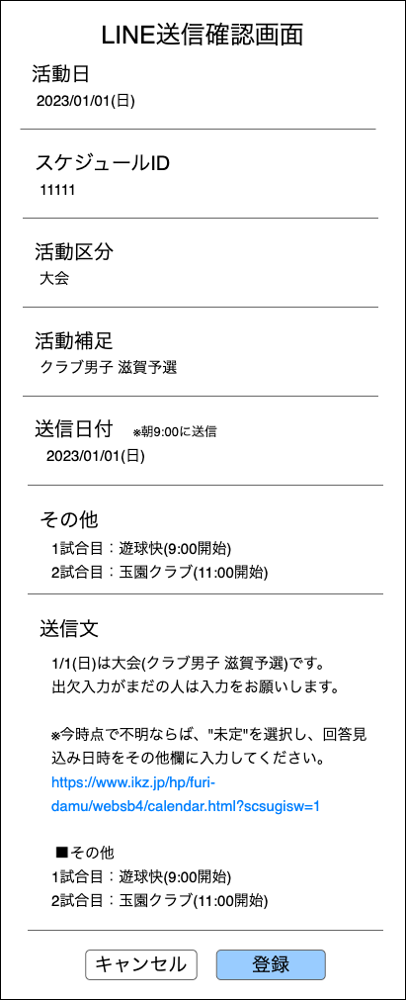

裏方作業システム 
LINE送信確認画面 

- [1. 画面概要](#1-画面概要)
- [2. POSTデータ](#2-postデータ)
- [3. 画面項目](#3-画面項目)
  - [3.1. 活動区分](#31-活動区分)
    - [3.1.1. 初期表示](#311-初期表示)
  - [3.2. 活動補足](#32-活動補足)
  - [3.3. その他](#33-その他)
  - [3.4. 送信文](#34-送信文)
    - [3.4.1. 文書生成](#341-文書生成)
    - [3.4.2. リンク表示](#342-リンク表示)
  - [3.5. キャンセルボタン](#35-キャンセルボタン)
    - [3.5.1. 押下処理](#351-押下処理)
  - [3.6. 登録ボタン](#36-登録ボタン)
    - [3.6.1. 押下処理](#361-押下処理)
    - [3.6.2. 画面内容とテーブルの紐付け](#362-画面内容とテーブルの紐付け)
    - [3.6.3. エラーアラートの表示](#363-エラーアラートの表示)
      - [3.6.3.1. 重複する活動日、送信日付](#3631-重複する活動日送信日付)
      - [3.6.3.2. スケジュールIDが存在しない場合](#3632-スケジュールidが存在しない場合)

# 1. 画面概要
- 滋賀フリーダム全体LINEに送信するスケジュール入力催促リマインダーの登録内容確認を行う

# 2. POSTデータ

| Key | Value形式 | 内容 |
| :--: | :-- | :-- |
| page | "5" | 画面ID※空白不可 |
| active_date | yyyyMMdd | 活動日 |
| active_class | X | 活動区分 |
| active_additional | テキスト | 活動補足 |
| send_date | yyyyMMdd | 送信日付 |
| other | テキスト | その他 |
| schedule_id | 半角数値 | スケジュールID |

# 3. 画面項目

| No | 項目 | 形式 | POSTデータとの対応 | その他 |
| :--: | :-- | :-- | :-- | :-- |
| 1 | 活動日 | ラベル | active_date |  |
| 2 | 活動区分 | ラベル | active_class |  |
| 3 | 活動補足 | ラベル | active_additional |
| 4 | 送信日付 | ラベル | send_date | |
| 5 | その他 | ラベル | other | |
| 6 | 送信文 | ラベル | | |
| 7 | キャンセル | ボタン | 押下時：LINE送信確認画面に遷移 |
| 8 | 登録 | ボタン | 押下時：データ登録 |
| 9 | スケジュールID | 隠し項目 | schedule_id | DB登録の際にエラーチェックを行うため |

## 3.1. 活動区分
### 3.1.1. 初期表示
- [活動区分の定義](../../../03_テーブル/readme.md)に沿って活動区分から表示する

## 3.2. 活動補足
- 活動補足が空白だった場合はこのセクション自体の表示をなくす

## 3.3. その他
- その他が空白だった場合はこのセクション自体の表示をなくす

## 3.4. 送信文
### 3.4.1. 文書生成

| 表示条件 | 文書 | その他 |
| :-- | :-- | :-- |
| 全共通 | [送信日付]は[活動区分]（[活動補足]）です。¥n  出席入力がまだの人は入力をお願いします。¥n ¥n | 活動区分は[コード定義](../../../03_テーブル/readme.md)の変換を行った上で表示 活動補足が空白の場合は"()"自体も省く |
| 送信区分が2,3,4 | ※今時点で不明ならば、"未定"を選択し、回答見込み日時をその他欄に入力してください。¥n | |
| 全共通 | https://www.ikz.jp/hp/furi-damu/websb4/calendar.html?scsugisw=1 | 滋賀フリーダムのスケジュールリンク |
| その他が空白でない | ¥n ¥n ・その他¥n [その他] | |

- ¥nは改行タイミング

### 3.4.2. リンク表示
- リンクを\<a>タグで囲む
  - \<a href="https://xxx" target="_blank">https://xxx</a>
- リンク押下時、別タブでリンク先を表示(target="_blank")
- 生成された送信文にリンクが存在する場合の判定は下記
  - https:// または http:// が存在する場合
- リンク化する範囲は以下の通り
  - リンク開始：https:// または http://
  - リンク終了：全・半角スペース または 改行コード どちらかの1文字前まで

## 3.5. キャンセルボタン
### 3.5.1. 押下処理
1. LINE送信登録画面に遷移
  - 以下のデータを送信
  
| Key | Value形式 | 内容 |
| :--: | :-- | :-- |
| page | "4" | 画面ID |
| active_date | yyyyMMdd | 活動日 |
| schedule_id | 半角数値 | スケジュールID |
| active_class | X | 活動区分 |
| active_additional | テキスト | 活動補足 |
| send_date | yyyyMMdd | 送信日付 |
| other | テキスト | その他 |

## 3.6. 登録ボタン
### 3.6.1. 押下処理

### 3.6.2. 画面内容とテーブルの紐付け
- 登録、取得は下記を紐づける

| 内容 | テーブル | カラム |
| :-- | :-- | :-- |
| 活動日 | schedules | active_date |
| 活動区分 | schedules | active_category |
| 活動補足 | schedules | additional_info |
| 送信日付 | remind_input_schedule_infos | send_date |
| その他 | remind_input_schedule_infos | other |
| "1" | remind_input_schedule_infos | send_category |
| "01" | remind_input_schedule_infos | line_id |

- データ定義は[こちら](../../../03_テーブル/readme.md)を参照

### 3.6.3. エラーアラートの表示
#### 3.6.3.1. 重複する活動日、送信日付
- 対象番号：1-a2-b2
- 表示内容は下記の通り
  - タイトル："活動日、送信日付は既に存在します。再度登録してください。"
  - ボタン："OK"
- 連続タップやブラウザバックから再度登録した際に重複したデータが作成されるのを防ぐため実装

#### 3.6.3.2. スケジュールIDが存在しない場合
- 対象番号：1-b2-b2
- 表示内容は下記の通り
  - タイトル："表示されたスケジュールIDは存在しません。再度登録してください。"