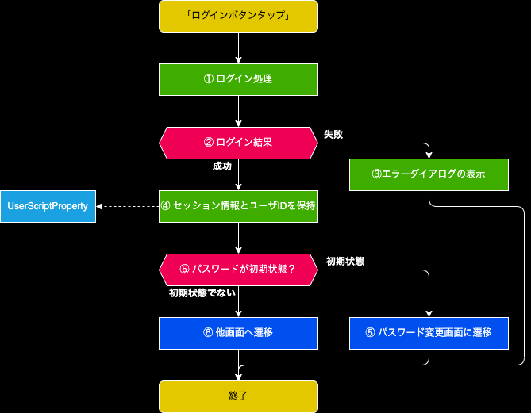

裏方作業システム 

# 1. 画面概要
- ログイン処理を行う

# 2. 画面項目

## 2.1. 処理フロー
- 全てのPOSTデータを保持する

## 2.2. ユーザID
- 3文字を入力制限とする

### 2.2.1. エラーチェックと表示内容
- 初期表示時はエラー文言を表示しない

| 条件 | 表示内容 | その他 |
| :--: | :-- | :-- |
| 3文字未満 | 半角英数字のみで3文字で入力してください。 |
| 入力文字は半角英数字以外 | 半角英数字のみで3文字で入力してください。 |

## 2.3. パスワード
- 16文字を入力制限とする

### 2.3.1. エラーチェックと表示内容
- 初期表示時はエラー文言を表示しない

| 条件 | 表示内容 | その他 |
| :--: | :-- | :-- |
| 8文字未満 | 半角英数字のみで8文字で入力してください。 |
| 入力文字は半角英数字以外 | 半角英数字のみで8文字で入力してください。 |

## 2.4. ログインボタン
### 2.4.1. 活性化条件
- ユーザID,パスワード両方でエラーが存在しない

### 2.4.2. 押下処理

#### 2.4.2.1. ① ログイン処理
- [authService.Login](../../../05_Service仕様書/02_AuthService/readme.md#2-ログイン機能login)で処理を実施

| INパラメータ | value |
| :--: | :-- |
| userId | 画面のユーザID |
| password | 画面のパスワード (SHA256でハッシュ化) |

#### 2.4.2.2. ③ エラーダイアログの表示
- 下記文言で表示
  - "ログインIDが存在しないか、パスワードが一致しません"

#### 2.4.2.3. ④ セッション情報とユーザIDの保持
- UserScriptPropertyにそれぞれ下記を保持

| key | value |
| :--: | :-- |
| session | ①で取得したOUTパラメータ.session |
| userId | 画面のユーザID |

#### 2.4.2.4. ⑤ パスワードが初期状態？
- 初期状態：①で取得したOUTパラメータ.isInitialPassword = true

#### 2.4.2.5. ⑥ パスワード変更画面に遷移
- 画面表示時に取得したPOSTパラメータを全て引き継ぐ

#### 2.4.2.6. ⑦ 他画面へ遷移
- 画面表示時に取得したPOSTパラメータを使用して画面処理を行う
- POSTパラメータが存在しない場合はTOPページへ遷移する
