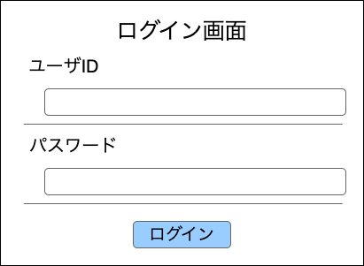

裏方作業システム 
LINE送信確認画面 

# 1. 画面概要
- ログイン処理を行う
  - 一旦はログイン・ログアウトのみの処理を実装する
  - セッション管理して自動ログイン機能も実施したい

# 2. 画面項目

## 2.1. 処理フロー
- 全てのPOSTデータを保持する

## 2.2. ユーザID
- 3文字を入力制限とする

### 2.2.1. エラーチェックと表示内容
- 初期表示時はエラー文言を表示しない

| 条件 | 表示内容 | その他 |
| :--: | :-- | :-- |
| 3文字未満 | 半角英数字のみで3文字で入力してください。 |
| 入力文字は半角英数字以外 | 半角英数字のみで3文字で入力してください。 |

## 2.3. パスワード
- 16文字を入力制限とする

### 2.3.1. エラーチェックと表示内容
- 初期表示時はエラー文言を表示しない

| 条件 | 表示内容 | その他 |
| :--: | :-- | :-- |
| 8文字未満 | 半角英数字のみで8文字で入力してください。 |
| 入力文字は半角英数字以外 | 半角英数字のみで8文字で入力してください。 |

## 2.4. ログインボタン
### 2.4.1. 活性化条件
- ユーザID,パスワード両方でエラーが存在しない

### 2.4.2. 押下処理
- ユーザIDとパスワードが一致している場合
1. セッションデータを保持する
1. 保持したPOSTデータをそのまま実行
- ユーザIDとパスワードが一致していない場合
  → アラートで"ユーザIDが存在しないかパスワードが一致しません"

※一致しているかどうかは下記の条件で絞る 
[members].[member_id] = ユーザID
[members].[password] = パスワード