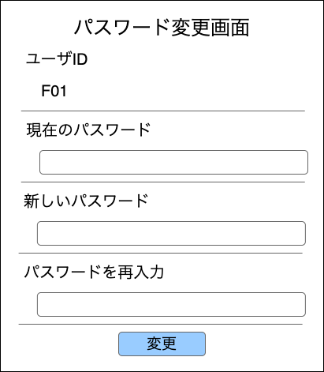
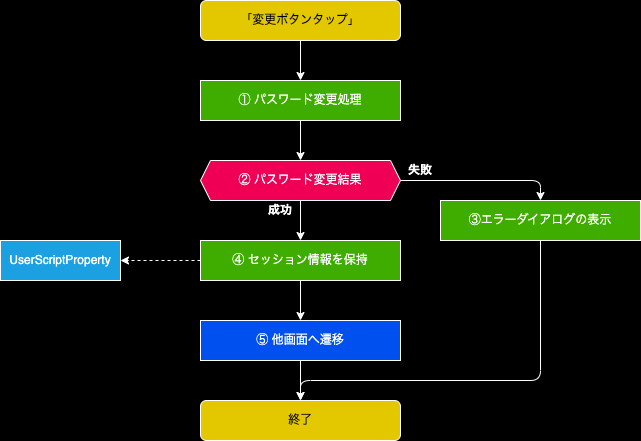

裏方作業システム 

# 1. 画面概要
- パスワードの変更を行う

# 2. 画面項目

## 2.1. 処理フロー
- 全てのPOSTデータを保持

## 2.2. ユーザID
- UserScriptProperty.userIdの値を表示

## 2.3. 現在のパスワード
- 16文字を入力制限とする

### 2.3.1. エラーチェックと表示内容
- 初期表示時はエラー文言を表示しない

| 条件 | 表示内容 | その他 |
| :--: | :-- | :-- |
| 8文字未満 | 半角英数字のみで8~16文字で入力してください。 |
| 入力文字は半角英数字以外 | 半角英数字のみで8~16文字で入力してください。 |

## 2.4. 新しいパスワード
- 16文字を入力制限とする

### 2.4.1. エラーチェックと表示内容
- 初期表示時はエラー文言を表示しない

| 条件 | 表示内容 | その他 |
| :--: | :-- | :-- |
| 8文字未満 | 半角英数字のみで8~16文字で入力してください。 |
| 入力文字は半角英数字以外 | 半角英数字のみで8~16文字で入力してください。 |

## 2.5. パスワードを再入力
- 16文字を入力制限とする

### 2.5.1. エラーチェックと表示内容
- 初期表示時はエラー文言を表示しない

| 条件 | 表示内容 | その他 |
| :--: | :-- | :-- |
| 現在のパスワードと一致しない | パスワードが一致しません |

## 2.6. 変更ボタン
### 2.6.1. 活性化条件
- 全ての項目でエラーが存在しない

### 2.6.2. 押下処理

#### 2.6.2.1. ① パスワード変更処理
- [authService.changePassword](../../../05_Service仕様書/02_AuthService/readme.md#4-パスワード変更処理changepassword)で処理を実施

| INパラメータ | Value | その他 |
| :--: | :-- | :-- |
| userId | ユーザID | |
| prePassword | 画面の現在のパスワード (SHA256でハッシュ化) |
| aftPassword | 画面の新しいパスワード (SHA256でハッシュ化) |

#### 2.6.2.2. ③ エラーダイアログの表示
- 下記文言で表示
  - "現在のパスワードが一致しません"

#### 2.6.2.3. ④ セッション情報の保持
- UserScriptPropertyに保持

| key | value |
| :--: | :-- |
| session | ①で取得したOUTパラメータ.session |

#### 2.6.2.4. ⑤ 他画面へ遷移
- 画面表示時に取得したPOSTパラメータを使用して画面処理を行う
- POSTパラメータが存在しない場合はTOPページへ遷移する