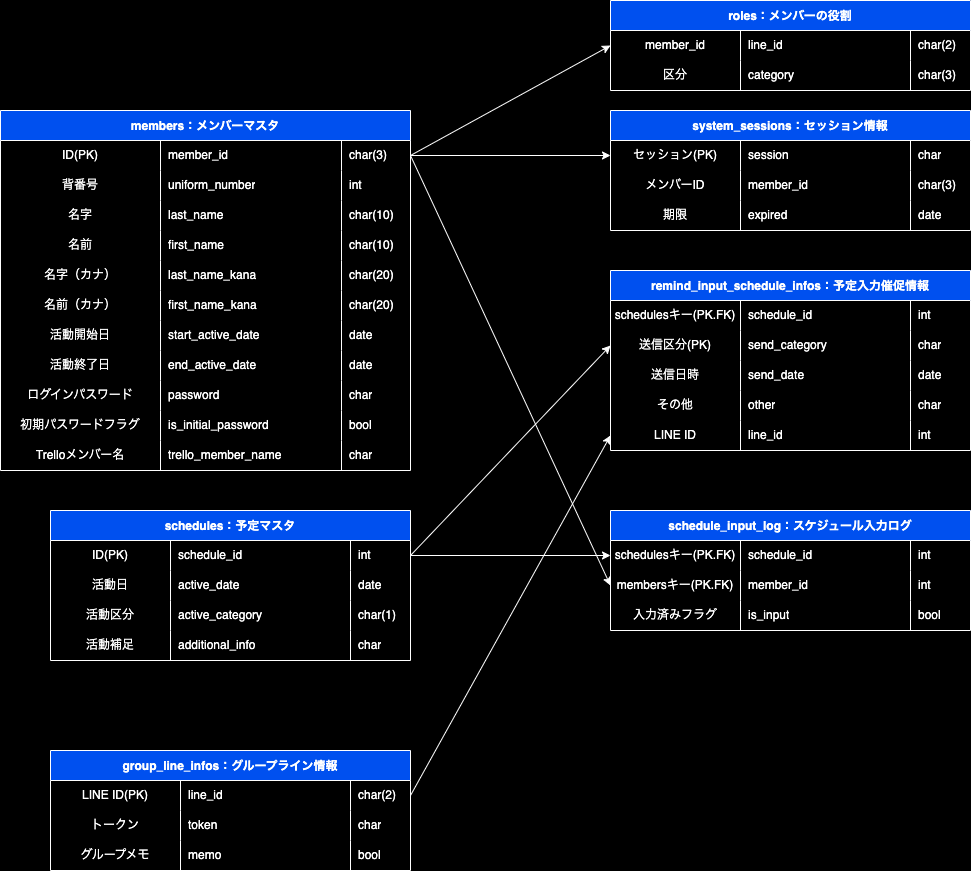

- [1. ER図](#1-er図)
- [2. マスタ情報](#2-マスタ情報)
  - [2.1. members：メンバーマスタ](#21-membersメンバーマスタ)
    - [2.1.1. ログインパスワード](#211-ログインパスワード)
    - [2.1.2. スケジュール入力催促区分:schedule\_remind\_category](#212-スケジュール入力催促区分schedule_remind_category)
      - [2.1.2.1. データ定義](#2121-データ定義)
  - [2.2. schedules：予定マスタ](#22-schedules予定マスタ)
    - [2.2.1. 活動区分:active\_category](#221-活動区分active_category)
      - [2.2.1.1. データ定義](#2211-データ定義)
  - [2.3. remind\_input\_schedule\_infos：予定入力催促情報](#23-remind_input_schedule_infos予定入力催促情報)
    - [2.3.1. 送信区分:send\_category](#231-送信区分send_category)
      - [2.3.1.1. データ定義](#2311-データ定義)
  - [2.4. group\_line\_infos：グループライン情報](#24-group_line_infosグループライン情報)
    - [2.4.1. LINE ID(PK):line\_id](#241-line-idpkline_id)
- [3. その他](#3-その他)

# 1. ER図

# 2. マスタ情報
- 下記の項目は各マスタにて共通の項目で存在

| 概要 | Column名 | 型 | その他 |
| :-- | :-- | :-- | :-- |
| 作成日時 | created_time | datetime |  |
| 作成者 | created_by | char(3) | FK：members.member_id |
| 作成ページID | created_page_id | char(2) |  |
| 更新日時 | updated_time | datetime |  |
| 更新者 | updated_by | char(3) | FK：members.member_id |
| 更新ページID | updated_page_id | char(2) |  |

## 2.1. members：メンバーマスタ

### 2.1.1. ログインパスワード
- SHA256でハッシュ化されたものを格納

### 2.1.2. スケジュール入力催促区分:schedule_remind_category
#### 2.1.2.1. データ定義

| 区分 | 概要 | その他 |
| :--: | :-- | :-- |
| 0 | スケジュール催促対象外 |  |
| 1 | スケジュール催促対象者 かつ 再催促対象外 |  |
| 2 | スケジュール催促対象者 かつ 再催促対象者  |  |

## 2.2. schedules：予定マスタ

### 2.2.1. 活動区分:active_category
#### 2.2.1.1. データ定義

| 区分 | 概要 | その他 |
| :--: | :-- | :-- |
| 1 | 練習 |  |
| 2 | 練習試合 |  |
| 3 | 大会 |  |
| 4 | 市大会・市リーグ戦 |  |
| 9 | その他 |  |

## 2.3. remind_input_schedule_infos：予定入力催促情報

### 2.3.1. 送信区分:send_category
#### 2.3.1.1. データ定義

| 区分 | 概要 | その他 |
| :--: | :-- | :-- |
| 1 | 初回スケジュール入力催促 | 全体グループ向け |
| 2 | 2回目以降のスケジュール入力催促 | 指定メンバー向け |
| 3 | 予定決定リマインド送信 | 連絡係向け |
| 4 | 入力者確認リマインド送信 | 連絡係向け  |

## 2.4. group_line_infos：グループライン情報
- データ削除することは基本的にNG

### 2.4.1. LINE ID(PK):line_id

| 区分 | 概要 | その他 |
| :--: | :-- | :-- |
| 01 | 全体グループ |  |

# 3. その他
- SpreadSheetを使用して、擬似的にテーブルを作成