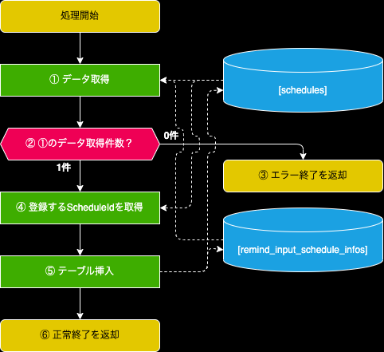

- [1. 概要](#1-概要)
- [2. データ取得(1件)：getData](#2-データ取得1件getdata)
  - [2.1. IF定義](#21-if定義)
    - [2.1.1. INパラメータ](#211-inパラメータ)
    - [2.1.2. OUTパラメータ](#212-outパラメータ)
  - [2.2. 処理フロー](#22-処理フロー)
- [2. 挿入処理：Insert](#2-挿入処理insert)
  - [2.1. IF定義](#21-if定義-1)
    - [2.1.1. INパラメータ](#211-inパラメータ-1)
    - [2.1.2. OUTパラメータ](#212-outパラメータ-1)
  - [2.2. 処理フロー](#22-処理フロー-1)
    - [① データ取得](#-データ取得)
    - [③ エラー終了を返却](#-エラー終了を返却)
    - [④ 登録するScheduleIdを取得](#-登録するscheduleidを取得)
    - [⑤ テーブル挿入](#-テーブル挿入)

# 1. 概要
- LINEスケジュール関連のServiceクラス

# 2. データ取得(1件)：getData
- LINEスケジュールの取得を行う

## 2.1. IF定義
### 2.1.1. INパラメータ

| Key | Value | その他 |
| :--: | :-- | :-- |
| activeDate | 活動日付 | "yyyy-MM-dd"形式で設定する |
| scheduleId | スケジュールID |  |

### 2.1.2. OUTパラメータ
| Key | Value | その他 |
| :--: | :-- | :-- |
| scheduleId | スケジュールID |
| activeDate | 活動日 | "yyyy-MM-dd"形式で設定返却する |
| activeCategory | 活動区分 | [データ定義参照](../../03_テーブル/readme.md#221-活動区分active_category) |
| additionalInfo | 追加情報 |  |
| sendDate | LINE送信日付 | "yyyy-MM-dd"形式で設定返却する |
| other | その他送信補足 |  |

## 2.2. 処理フロー
1. 下記内容で条件を絞る(AND条件)
  - INパラメータ.activeDateが存在する場合
    - [schedules].[active_date] = INパラメータ.activeDate
  - INパラメータ.scheduleIdが存在する場合
    - [schedules].[schedule_id] = INパラメータ.scheduleId
  - [remind_input_schedule_infos].[send_category] = "1"([初回スケジュール入力催促](../../03_テーブル/readme.md#231-送信区分send_category))
2. resoponseDataの返却値は下記になる
  - 取得件数が0件の場合はnullを返却
  - 取得件数が1件の場合は下記データを返却

| Key | Value | その他 |
| :--: | :-- | :-- |
| scheduleId | [schedules].[schedule_id] |  |
| activeDate | [schedules].[active_date] | "yyyy-MM-dd"形式に変換 |
| activeCategory | [schedules].[active_category] |  |
| additionalInfo | [schedules].[additional_info] |  |
| sendDate | [remind_input_schedule_infos].[send_date] | "yyyy-MM-dd"形式に変換 |
| other | [remind_input_schedule_infos].[other] |  |

# 2. 挿入処理：Insert
- LINEスケジュールの挿入を行う

## 2.1. IF定義
### 2.1.1. INパラメータ

| Key | Value | その他 |
| :--: | :-- | :-- |
| activeDate | 活動日付 | "yyyy-MM-dd"形式で設定する |
| activeCategory | 活動区分 | [データ定義参照](../../03_テーブル/readme.md#221-活動区分active_category) |
| additionalInfo | 追加情報 |  |
| sendDate | 送信日 | "yyyy-MM-dd"形式で設定する |
| other | 活動区分 | その他送信補足 |
| userId | メンバーID | |
| pageId | ページID |  |

### 2.1.2. OUTパラメータ
- なし

## 2.2. 処理フロー

### ① データ取得
- [LineReminderService.getData()](#2-データ取得1件getdata)でデータ取得する

| Key | Value | その他 |
| :--: | :-- | :-- |
| activeDate | INパラメータ.activeDate |  |

### ③ エラー終了を返却
- 下記エラーで返却する

| key | value |
| :-- | :--: |
| errorMessage | "指定した活動日は既に存在します。\n再度登録してください。" |
| errorCode | "E_01_001" |

### ④ 登録するScheduleIdを取得
- [schedules]テーブル全件の中から最大値を取得し、インクリメント

### ⑤ テーブル挿入
- 下記データで[schedules]に挿入

| key | value | その他 |
| :--: | :-- | :-- |
| schedule_id | ④で取得したID | |
| active_date | INパラメータ.activeDate | 日付型に変換する | |
| active_category | INパラメータ.activeCategory | |
| additional_info | INパラメータ.additionalInfo | |
 

- 下記データで[remind_input_schedule_infos]に挿入

| key | value | その他 |
| :--: | :-- | :-- |
| schedule_id | ④で取得したID |
| send_category | "1" | [データ定義参照](../../03_テーブル/readme.md#231-送信区分send_category) |
| send_date | INパラメータ.sendDate | 日付型に変換する |
| other | INパラメータ.other |