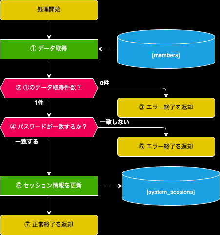
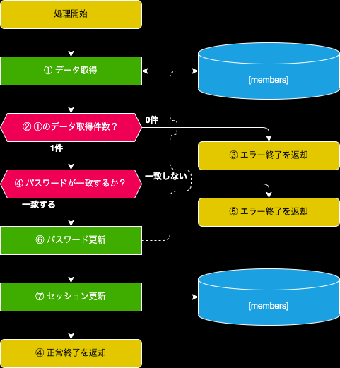

- [1. 概要](#1-概要)
- [2. ログイン機能：Login](#2-ログイン機能login)
  - [2.1. IF定義](#21-if定義)
    - [2.1.1. INパラメータ](#211-inパラメータ)
    - [2.1.2. OUTパラメータ](#212-outパラメータ)
  - [2.2. 処理フロー](#22-処理フロー)
    - [2.2.1. ① データ取得](#221--データ取得)
    - [2.2.2. ③ エラー終了を返却](#222--エラー終了を返却)
    - [2.2.3. ⑤ エラー終了を返却](#223--エラー終了を返却)
    - [⑦ セッション更新](#-セッション更新)
    - [2.2.4. ⑦ 正常終了を返却](#224--正常終了を返却)
- [3. ログイン状態確認：isLogin](#3-ログイン状態確認islogin)
  - [3.1. IF定義](#31-if定義)
    - [3.1.1. INパラメータ](#311-inパラメータ)
    - [3.1.2. OUTパラメータ](#312-outパラメータ)
  - [3.2. 処理フロー](#32-処理フロー)
    - [3.2.1. ① データ取得](#321--データ取得)
    - [3.2.2. ③ エラー終了を返却](#322--エラー終了を返却)
    - [3.2.3. ④ 正常終了を返却](#323--正常終了を返却)
- [4. パスワード変更処理:changePassword](#4-パスワード変更処理changepassword)
  - [4.1. IF定義](#41-if定義)
    - [4.1.1. INパラメータ](#411-inパラメータ)
    - [4.1.2. OUTパラメータ](#412-outパラメータ)
  - [4.2. 処理フロー](#42-処理フロー)
    - [4.2.1. ① データ取得](#421--データ取得)
    - [4.2.2. ③ エラー終了を返却](#422--エラー終了を返却)
    - [4.2.3. ⑤ エラー終了を返却](#423--エラー終了を返却)
    - [4.2.3. ⑥ パスワード更新](#423--パスワード更新)
    - [⑦ セッション更新](#-セッション更新-1)
    - [⑧ 正常終了を返却](#-正常終了を返却)

# 1. 概要
- 認証関連のServiceクラス

# 2. ログイン機能：Login
- 裏方システムのログイン処理を行う

## 2.1. IF定義
### 2.1.1. INパラメータ

| Key | Value | その他 |
| :--: | :-- | :-- |
| userId | ユーザID | |
| password | パスワード | SHA256でハッシュ化しておく |

### 2.1.2. OUTパラメータ
| Key | Value |
| :--: | :-- |
| session | セッション情報 |
| isInitialPassword | 初期パスワードか |

## 2.2. 処理フロー

### 2.2.1. ① データ取得
- 下記条件でデータを取得する
[members].[member_id] = userId
[members].[password] = password

### 2.2.2. ③ エラー終了を返却
- 下記エラーで返却する

| key | value |
| :-- | :--: |
| errorMessage | "ユーザIDが存在しません" |
| errorCode | "Auth01" |

### 2.2.3. ⑤ エラー終了を返却
- 下記エラーで返却する

| key | value |
| :-- | :--: |
| errorMessage | "パスワードが一致しません" |
| errorCode | "Auth02" |

### ⑦ セッション更新
下記データを[system_sessions]に挿入

| key | value |
| :--: | :-- |
| session | 生成されたセッションID |
| member_id | inパラメータ.userId |
| expired | 本日から1ヶ月後 |

### 2.2.4. ⑦ 正常終了を返却
- 下記情報をresponseDataに入れて返却

| key | value |
| :--: | :-- |
| session | ⑥で生成したセッション |
| isInitialPassword | [members].[is_initial_password] |

# 3. ログイン状態確認：isLogin
- 裏方システムのログイン状態を判定する

## 3.1. IF定義
### 3.1.1. INパラメータ
| Key | Value | その他 |
| :--: | :-- | :-- |
| session | セッションID | |

### 3.1.2. OUTパラメータ
| Key | Value |
| :--: | :-- |
| isInitialPassword | 初期パスワードか |

## 3.2. 処理フロー

### 3.2.1. ① データ取得
- 下記条件でデータを取得する
[system_sessions].[session] = inパラメータ.session
[system_sessions].[expired] <= 本日日付
[members].[member_id] = [system_sessions].[member_id]

### 3.2.2. ③ エラー終了を返却
- 下記エラーで返却する

| key | value |
| :-- | :--: |
| errorMessage | "ログインをしてください" |
| errorCode | "Auth03" |

### 3.2.3. ④ 正常終了を返却
- 下記情報をresponseDataに入れて返却

| key | value |
| :--: | :-- |
| isInitialPassword | [members].[is_initial_password] |

# 4. パスワード変更処理:changePassword
- パスワードの変更を行う

## 4.1. IF定義
### 4.1.1. INパラメータ

| Key | Value | その他 |
| :--: | :-- | :-- |
| userId | ユーザID | |
| session | セッション情報 | nullも可能 |
| prePassword | 変更前パスワード | SHA256でハッシュ化しておく |
| aftPassword | 変更後パスワード | SHA256でハッシュ化しておく |

### 4.1.2. OUTパラメータ
| Key | Value |
| :--: | :-- |
| session | セッション情報 |

## 4.2. 処理フロー

### 4.2.1. ① データ取得
- 下記条件でデータを取得する
[members].[member_id] = userId
[members].[password] = prePassword

### 4.2.2. ③ エラー終了を返却
- 下記エラーで返却する

| key | value |
| :-- | :--: |
| errorMessage | "ユーザIDが存在しません" |
| errorCode | "Auth05" |

### 4.2.3. ⑤ エラー終了を返却
- 下記エラーで返却する

| key | value |
| :-- | :--: |
| errorMessage | "パスワードが一致しません" |
| errorCode | "Auth06" |

### 4.2.3. ⑥ パスワード更新
- ①の条件で下記情報を更新
[members].[password] = aftPassword

### ⑦ セッション更新
1. 下記条件で[system_sessions]からすべて削除する
[system_sessions].[member_id] = inパラメータ.userId
2. 下記データを[system_sessions]に挿入

| key | value |
| :--: | :-- |
| session | 生成されたセッションID |
| member_id | inパラメータ.userId |
| expired | 本日から1ヶ月後 |

### ⑧ 正常終了を返却
- 下記情報をresponseDataに入れて返却

| Key | Value |
| :--: | :-- |
| session | ⑦で生成したセッションID |